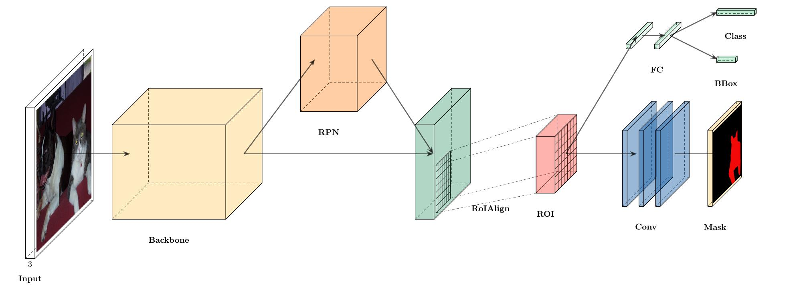
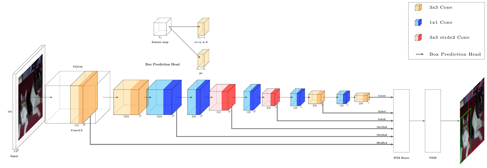
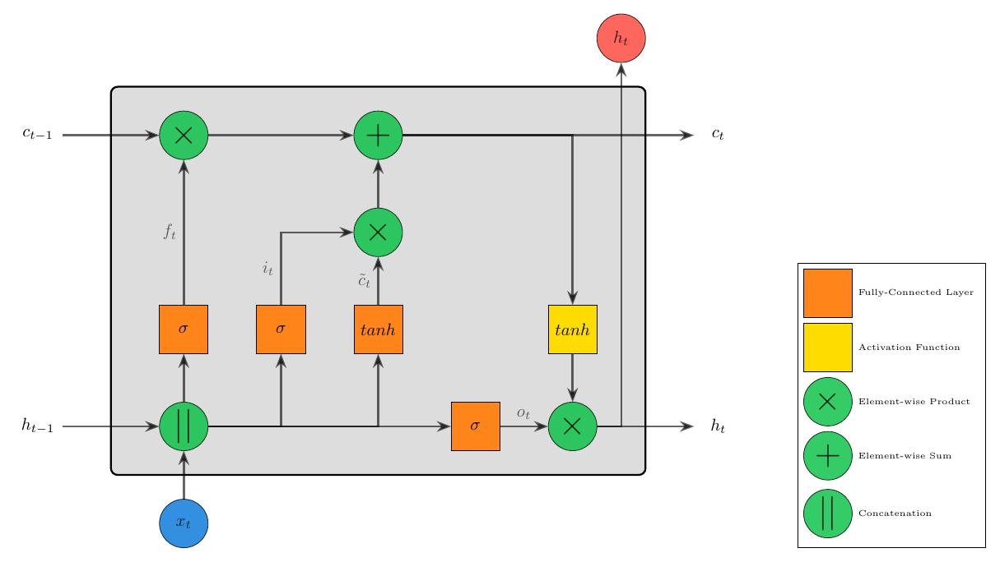

# PlotNeuralNet
[](https://doi.org/10.5281/zenodo.2526396)

Latex code for drawing neural networks for reports and presentation. Have a look into examples to see how they are made. Additionally, lets consolidate any improvements that you make and fix any bugs to help more people with this code.

## Examples

Following are some network representations:

||
|:--:| 
| *VGG16* |

||
|:--:| 
| *Mask-RCNN* |

||
|:--:| 
| *Single Shot MultiBox Detector (SSD)* |

||
|:--:| 
| *Long Short-Term Memory (LSTM)* |

## Getting Started
1. Install latex and other dependencies.
    * Ubuntu 16.04
        ``` bash
        sudo apt-get install texlive-latex-extra
        ```

    * Ubuntu 18.04.2  
    Base on this [website](https://gist.github.com/rain1024/98dd5e2c6c8c28f9ea9d), please install the following packages.
        ``` bash
        sudo apt-get install texlive-latex-base
        sudo apt-get install texlive-fonts-recommended
        sudo apt-get install texlive-fonts-extra
        sudo apt-get install texlive-latex-extra
        ```

    * Windows
    1. Download and install [MikTeX](https://miktex.org/download).
    2. Download and install bash runner on Windows, recommends [Git bash](https://git-scm.com/download/win) or [Cygwin](https://www.cygwin.com/)

2. Install package
    ``` bash
    git clone https://github.com/xrz000/PlotNeuralNet.git
    cd PlotNeuralNet
    pip install -e . # or python setup.py develop
    ```

2. Execute the example as followed.
    ``` bash
    cd examples/Python
    bash ../../tikzmake.sh test_simple
    ```

## TODO

- [X] Python interface
- [X] Add easy legend functionality
- [ ] Add more layer shapes like TruncatedPyramid, 2DSheet etc
- [X] Add examples for RNN and likes.

## Latex usage

See [`examples/LaTex`](examples/LaTex) directory for usage.

## Python usage

First, create a new directory and a new Python file:

    $ mkdir my_project
    $ cd my_project
    vim my_arch.py

Add the following code to your new file:

```python
import sys
from plotnn import plotnn
import plotnn.tikzeng as tk


def main():
    namefile = str(sys.argv[0]).split('.')[0]
    arch = [
        tk.Conv2D("conv1", out_width=512, out_channel=64, location=(0, 0, 0), offset=(0, 0, 0),
                  height=64, depth=64, width=2, caption="Conv"),
        tk.Pool("pool1", location="conv1-east", offset=(1, 0, 0), height=32, depth=32, width=2, caption="MaxPool"),
        tk.Connection("conv1", "pool1"),

        tk.Conv2D("conv2", out_width=128, out_channel=64, location="pool1-east", offset=(2, 0, 0),
                  height=32, depth=32, width=2, caption="Conv"),
        tk.Connection("pool1", "conv2"),

        tk.Pool("pool2", location="conv2-east", offset=(1, 0, 0), height=16, depth=16, width=2, caption="MaxPool"),
        tk.Connection("conv2", "pool2"),

        tk.Softmax("soft1", out_channel=10, location="pool2-east", offset=(3, 0, 0), height=16, depth=16, width=2, caption="Softmax"),
        tk.Connection("pool2", "soft1"),

        tk.Sum("sum1", location="soft1-east", offset=(1.5, 0, 0), radius=2.5, opacity=0.6),
        tk.Connection("soft1", "sum1"),
    ]
    plotnn.generate([arch], namefile + '.tex')


def main():
    namefile = str(sys.argv[0]).split('.')[0]
    to_generate(arch, namefile + '.tex')

if __name__ == '__main__':
    main()
```

Now, run the program as follows:

    bash ../tikzmake.sh my_arch
